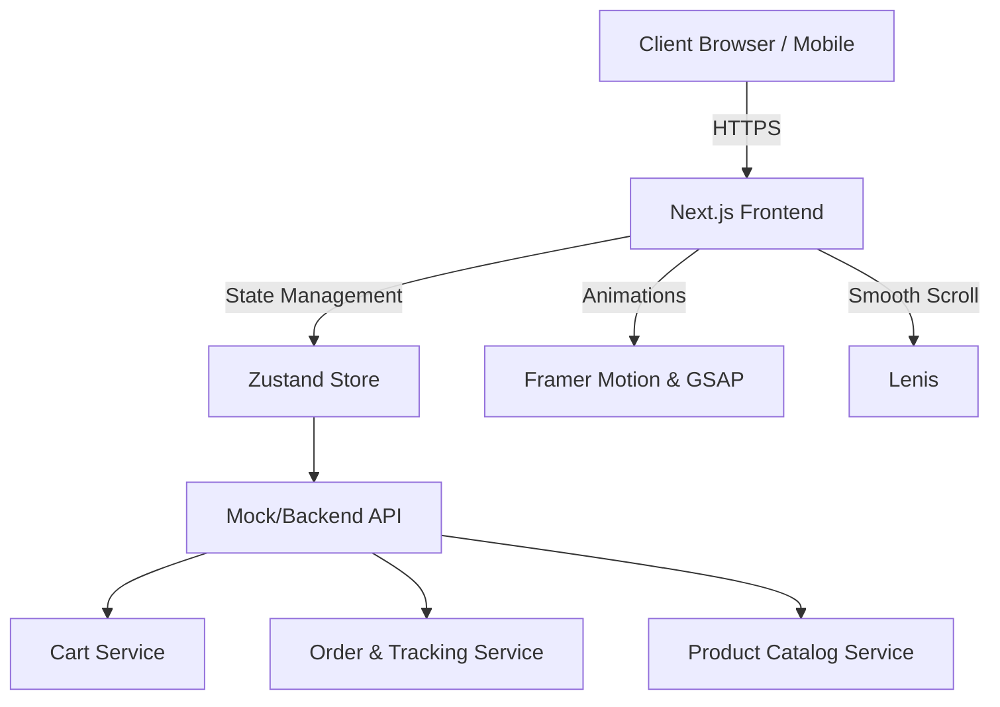
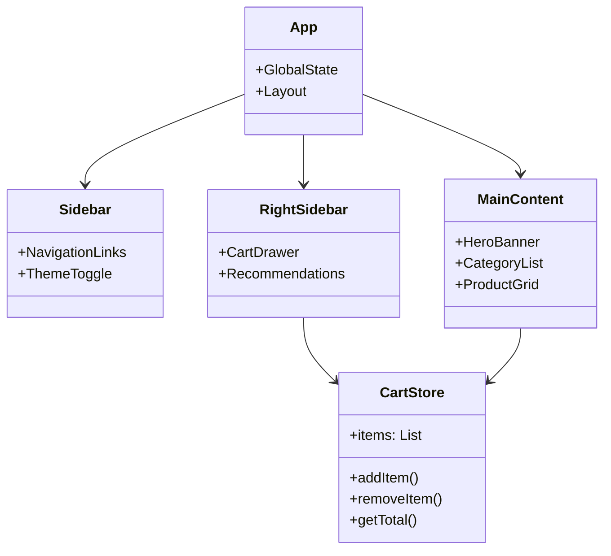

# NovaShop E-Commerce System Design

## 🌟 Overview
NovaShop is a premium SaaS E-Commerce platform designed with a modern aesthetic and smooth, dynamic animations. It features proper cart management, live order tracking, and a rich, responsive interface powered by Next.js, Framer Motion, GSAP, and Lenis.

## 📐 High-Level Design (HLD)

### Architecture Flow



### Explanation (Simple Words)
1. **Client**: The user visits the website on their browser or phone.
2. **Next.js Frontend**: The application loads fast, delivering beautifully designed UI components (like the sidebar, product grids, and cart).
3. **Zustand**: Acts as the "memory" of the application on the browser, keeping track of what's in the cart and user preferences without reloading.
4. **Animations**: Framer Motion and GSAP bring the UI to life with smooth transitions, while Lenis makes scrolling buttery smooth.
5. **Services (Mocked for now)**: Handle fetching products, adding items to the cart, and checking live order status.

---

## 🛠 Low-Level Design (LLD)

### Component Structure



### Core Modules
1. **`CartStore` (Zustand)**: A global state to manage cart items, automatically recalculating subtotals and discounts.
2. **`ProductCard` (Component)**: Displays individual items with hover effects and quick "Add to Cart" actions.
3. **`LiveTracking` (Component)**: A UI module showing order status (Processing, Shipped, Delivered) using visually appealing progress steps.

---

## 🎨 UI/UX Features
- **Premium Glassmorphism**: Soft shadows, semi-transparent backgrounds, and vibrant gradients.
- **Micro-Animations**: Hover states, clicking feedback, and element entrance animations.
- **Smooth Scrolling**: Lenis ensures scrolling feels native and frictionless.

---

## 🚀 GitHub Pages Deployment Guide

To deploy this Next.js application to GitHub Pages, you must export it as a static HTML application. Next.js 13+ App Router fully supports static exports. Follow these configuration steps:

### 1. Update `next.config.mjs`
To output a static build, open your `next.config.mjs` file and add `output: 'export'`. You also need to disable Next.js built-in image optimization since the GitHub Pages server doesn't support the Next.js Node.js image optimization API.

```javascript
/** @type {import('next').NextConfig} */
const nextConfig = {
  output: 'export',
  // IMPORTANT: If you are deploying to a repository URL like https://username.github.io/repo-name/
  // You must uncomment and configure the basePath below to match your repository name:
  // basePath: '/your-repository-name',
  
  images: {
    unoptimized: true, // Required for static export
  },
};

export default nextConfig;
```

### 2. Update `package.json`
Next.js handles the export automatically with the `output: 'export'` config, so your standard build command is sufficient. Ensure it looks like this in your `package.json`:

```json
"scripts": {
  "dev": "next dev",
  "build": "next build",
  "start": "next start",
  "lint": "next lint"
}
```

### 3. Deploy using GitHub Actions (Recommended)
The most automated way to deploy Next.js to GitHub Pages is using GitHub Actions. 

1. Create a folder in your project root called `.github/workflows/`.
2. Inside that folder, create a file named `deploy.yml`.
3. Add the following configuration to `deploy.yml`:

```yaml
name: Deploy Next.js site to Pages

on:
  push:
    branches: ["main"]
  workflow_dispatch:

permissions:
  contents: read
  pages: write
  id-token: write

concurrency:
  group: "pages"
  cancel-in-progress: false

jobs:
  build:
    runs-on: ubuntu-latest
    steps:
      - name: Checkout
        uses: actions/checkout@v4
      - name: Setup Node
        uses: actions/setup-node@v4
        with:
          node-version: "20"
      - name: Install dependencies
        run: npm ci
      - name: Build with Next.js
        run: npm run build
      - name: Upload artifact
        uses: actions/upload-pages-artifact@v3
        with:
          path: ./out

  deploy:
    environment:
      name: github-pages
      url: ${{ steps.deployment.outputs.page_url }}
    runs-on: ubuntu-latest
    needs: build
    steps:
      - name: Deploy to GitHub Pages
        id: deployment
        uses: actions/deploy-pages@v4
```

### 4. Configure GitHub Repository Settings
1. Go to your repository on GitHub.
2. Navigate to **Settings** > **Pages** (in the left sidebar).
3. Under **Build and deployment** > **Source**, select **GitHub Actions**.
4. Commit your changes and push to `main`. The Action will automatically run and deploy your site!
